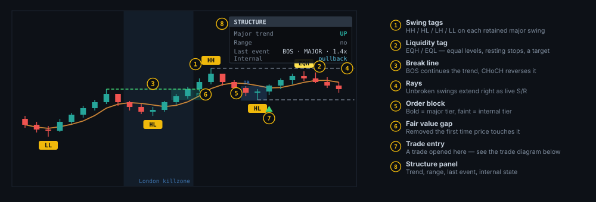
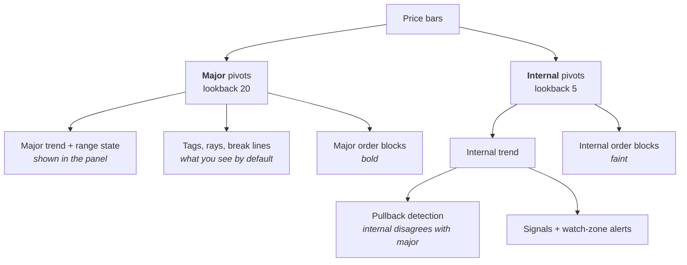
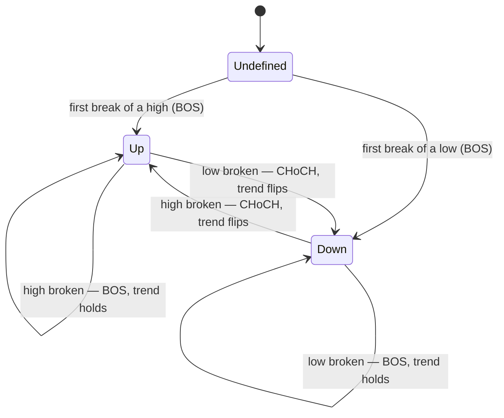
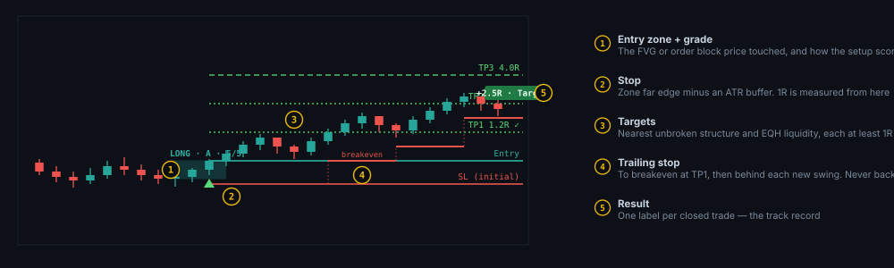
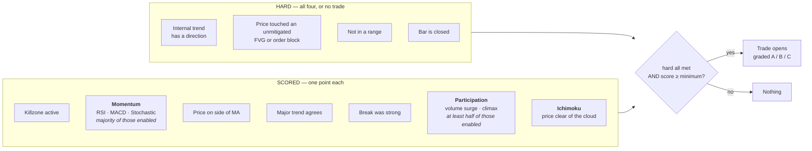
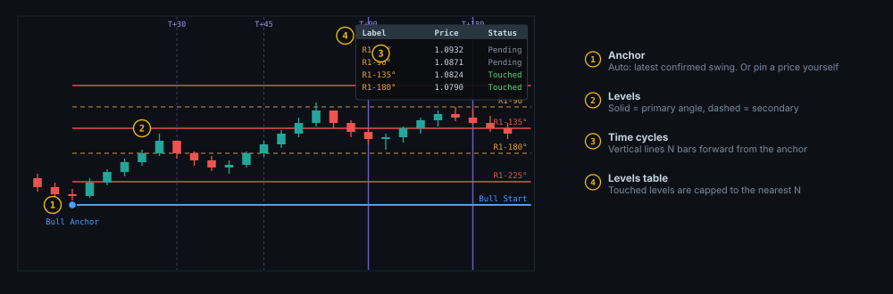

🌐 [Read this in English](README.md)

# مؤشرات TradingView

مؤشرَا Pine Script v6 لمنصة TradingView، مكتوبان ليُقرآ محتواهما بقدر ما يُستخدَمان. كلاهما ملف واحد
مستقل بذاته — بلا مكتبات، بلا بيانات خارجية، لا شيء يحتاج تثبيتًا سوى لصق السكربت في TradingView.

| السكربت | ماذا يفعل | اللوحة |
|---|---|---|
| [`src/ict-rsi-ma-indicator.pine`](src/ict-rsi-ma-indicator.pine) | يرصد بنية السوق (Market Structure)، الـ Order Blocks، الـ Fair Value Gaps، وجلسات الـ Killzone، ثم يقيّم كل ذلك في صفقات مُصنَّفة بدرجة (Grade) مع منطقة دخول، وقف خسارة، أهداف، ووقف متحرك | على الرسم البياني للسعر |
| [`src/gann-angles.pine`](src/gann-angles.pine) | مستويات غان السعرية (ثلاثة أنماط) مُسقَطة من نقطة ارتكاز تلقائية أو يدوية، بالإضافة إلى دورات غان الزمنية | على الرسم البياني للسعر |

المؤشران مستقلان تمامًا. شغّل أيًا منهما بمفرده، أو كليهما معًا.

---

## التثبيت

1. افتح رسمًا بيانيًا على [tradingview.com](https://www.tradingview.com).
2. افتح **Pine Editor** (اللوحة السفلية).
3. افتح ملف الـ `.pine` من هذا المستودع، انسخ محتواه كاملًا، والصقه في المحرر بدلًا من أي محتوى موجود.
4. اضغط **Add to chart**.
5. للاحتفاظ به: اضغط **Save**، أعطه اسمًا، وسيظهر تحت *Indicators → My scripts*.

تصل إلى الإعدادات من خلال أيقونة الترس (gear) بجانب اسم المؤشر على الرسم البياني.

---

# ICT + RSI/MA Confluence

## الفكرة

يميل السعر إلى الانعكاس عند المستويات التي غادرها بسرعة، وهذه الانعكاسات تستحق الأخذ بها **فقط عندما
تتفق عدة عوامل مستقلة في آن واحد**. هذا المؤشر يجد هذه المستويات، يتتبع الاتجاه البنيوي للسوق، ويحدد
الشموع التي تتوافق فيها كل هذه العوامل.

المؤشر لا يخبرك أبدًا بالشراء. هو يحدد شمعة توافقت فيها عدة شروط مستقلة، يقيّم عددها، ويترك القرار لك.

## قراءة الرسم البياني



### المصطلحات

معظم هذه المصطلحات مأخوذة من تداول "Smart Money Concepts". تبدو كمصطلحات متخصصة لكن كل واحد منها
يعبّر عن فكرة بسيطة:

| المصطلح | ماذا يعني فعليًا |
|---|---|
| **Swing high / low** | شمعة أعلى (أو أقل) من عدد محدد من الشموع على جانبيها |
| **HH / HL / LH / LL** | Higher High، Higher Low، Lower High، Lower Low — كيف تُقارَن قمة/قاع بالتي قبلها على نفس الجانب |
| **EQH / EQL** | Equal High / Equal Low. قمتان أو قاعان عند سعر شبه متطابق. أوامر وقف الخسارة تتكدس بالقرب منها، لذا يُجذَب السعر إليها غالبًا |
| **BOS** | Break of Structure — كسر البنية. أغلق السعر متجاوزًا نقطة swing **في اتجاه الترند القائم بالفعل** — استمرارية |
| **CHoCH** | Change of Character — تغيّر الطابع. أغلق السعر متجاوزًا نقطة swing **عكس** الترند — هذا ما يقلب الاتجاه |
| **Order block** | آخر شمعة معاكسة اللون قبل كسر بنيوي. غالبًا ما تتم زيارتها مجددًا قبل أن يواصل السعر تحركه |
| **FVG** | Fair Value Gap: نمط من ثلاث شموع تتحرك فيه الشمعة الوسطى بسرعة كبيرة بحيث تترك فجوة سعرية. يعود السعر لملئها كثيرًا |
| **Killzone** | نافذة زمنية تكون فيها إحدى الجلسات الرئيسية نشطة (لندن، نيويورك، وآسيا اختياريًا). تتركز فيها السيولة |

## كيف يعمل محرك البنية (Structure Engine)

يُرصَد الـ swing على **مستويين في آن واحد**، لأن إعدادًا واحدًا لا يمكنه أداء الوظيفتين معًا. المدى
القصير (lookback) يلتقط كل تذبذب صغير — مفيد لتوقيت الدخول، عديم الجدوى لقراءة الترند. المدى الطويل
يقرأ الترند بوضوح لكنه يُخفي كل مستوى قد تتداول عليه فعليًا.



> *ملاحظة: المخطط أعلاه ورد بالإنجليزية كما هو في الكود، تجنبًا لأي مشاكل عرض في Mermaid عند خلط
> النصوص العربية بعلامات HTML الداخلية.*

كلا المستويين يشغّل نفس خط المعالجة (pipeline) بشكل مستقل. اللوحة تعرض المستوى الرئيسي (Major)،
بينما محرك الإشارات يقرأ حاليًا المستوى الداخلي (Internal).

### BOS مقابل CHoCH — آلة حالة الترند

الترند لا يتغيّر إلا عند حدوث **CHoCH**. أما الـ BOS فيؤكد الترند الموجود بالفعل.



لا يُسجَّل الكسر إلا عندما تغلق شمعة **مغلقة** متجاوزةً المستوى. الفتيل (wick) العابر للمستوى لا يُعدّ
كسرًا، فلا يظهر شيء ثم يختفي فجأة.

كل كسر يسجّل أيضًا مدى قوته — جسم الشمعة الكاسرة مقسومًا على الـ ATR — بحيث يمكن التمييز بين كسر
مقنع وآخر ضعيف بدلًا من تجاهل هذا الفارق بصمت.

### حالة النطاق (Range)

الترند ليس القصة كاملة: قد يكون السوق "صاعدًا" من الناحية الفنية بينما لا يذهب إلى أي مكان، وهنا
تُحدِث إشارات متابعة الترند أكبر ضرر. لذا تُرفَع علامة **Range** منفصلة عندما تقع آخر قمتين رئيسيتين
وآخر قاعين رئيسيين جميعًا داخل نطاق ضيق (افتراضيًا 2.5 × ATR) **و** تكون هذه القمم/القيعان الأربع
حديثة (افتراضيًا خلال 100 شمعة).

الشرط الثاني مهم — فبدونه يمكن لأربع نقاط swing متناثرة عبر مئات الشموع أن تقع صدفةً داخل نطاق ضيق
وتُقرأ كتجميع (consolidation) رغم أن شيئًا من هذا لم يحدث فعليًا.

> **النطاق (Range) هو فيتو صارم.** لا تُفتَح أي صفقة أثناء قراءته `YES`، مهما بدا الإعداد جيدًا — هذا
> هو الهدف من تتبعه. كما يُعرَض في اللوحة حتى تطبّق حكمك الخاص على كل شيء آخر في الرسم البياني.

### لوحة البنية (Structure Panel)

| الصف | المعنى |
|---|---|
| **Major trend** | `UP`، أو `DOWN`، أو `—` قبل أول كسر |
| **Range** | `YES` عندما تكون البنية في حالة انضغاط — تعامل مع إشارات الترند بحذر |
| **Last event** | آخر كسر: نوعه، وأي مستوى (tier)، وقوته بوحدات الـ ATR (مثال: `BOS · MAJOR · 1.4x`) |
| **Internal** | `aligned` عندما يتفق المستويان؛ `pullback` عندما يتحرك المستوى الصغير عكس المستوى الكبير — غالبًا ما يكون هذا هو الإعداد المطلوب |

## محرك الصفقات (Trade Engine)

المثلث لم يعد يعني فقط "توافقت الشروط" — بل يعني **فتح صفقة فعلية**، بمنطقة دخول، وقف خسارة، ثلاثة
أهداف، ووقف يتحرك (trailing stop). صفقة واحدة تعمل في كل مرة؛ وطالما هي مفتوحة، تُتجاهل أي إعدادات
جديدة تظهر.



### كيف يتأهل الإعداد (Setup)

نوعان مختلفان من الشروط، والفرق بينهما مهم:



الشروط الأربعة الصارمة (HARD) مطلقة، لأنه بدونها لا يوجد شيء يمكن حسابه — لا اتجاه يعني لا جانب
(long/short)، ولا منطقة تعني لا سعر دخول ولا وقف خسارة.

**الدرجة (Score) هي من عدد النقاط المُفعَّلة، وليست دائمًا من سبعة.** هذا مقصود. الـ Killzones لا
تعني شيئًا في سوق أحادي الجلسة مثل البورصة المصرية (EGX)، فلو كانت نقطة الـ killzone شرطًا إلزاميًا
(veto) لتوقف المؤشر عن العمل هناك تمامًا. أوقف نقطة الـ killzone وستقرأ اللوحة `5/6` بدلًا من `5/7` —
العتبة تتكيّف بدلًا من أن تتراخى بصمت. نفس الشيء يحدث تلقائيًا للنقاط التي لا يمكن أن تنطبق: أوقف
جلستَي الـ killzone كلتيهما فتُزيل نقطة الـ killzone نفسها، وعلى رمز لا يُبلغ عن أي حجم تداول (volume)
تُزيل نقطة الـ Participation نفسها أيضًا.

**ثلاثة من التأكيدات الخمسة تتشارك في صوت واحد، عن قصد.** الـ RSI والـ MACD والـ Stochastic تقيس
جميعها الزخم (momentum) من نفس سلسلة الأسعار — لو حُسبت منفصلة لأعطت ثلاثة من عشرة أصوات لما هو في
الحقيقة رأي واحد، وقد يتجاوز الإعداد العتبة لمجرد أن الزخم يتفق مع نفسه. لذا تتشارك في نقطة Momentum
واحدة، تُكتسَب عندما يتفق نصف المؤشرات المُفعَّلة على الأقل. الحجم (Volume) وشمعة الـ climax تتشاركان
في نقطة Participation بنفس الطريقة.

**الدرجات (Grades) هي نسبة من النقاط المُفعَّلة** — درجة A عند 90%، B عند 75%، C دون ذلك. لذا تعني
الدرجة نفس الشيء سواء شغّلت أربع نقاط أو سبعًا.

اضبط `Minimum Score` مساويًا لعدد النقاط المُفعَّلة للحصول على أشد سلوك ممكن صرامة.

> **هل تُحدّث من نسخة أقدم؟** أصبح `Minimum Score` الآن 5 افتراضيًا، لأن 4 من سبعة نقاط هي عتبة
> **أخف** من 4 من خمسة كما كانت سابقًا. يحتفظ TradingView بالقيمة المحفوظة على رسمك البياني، فلو كانت
> لا تزال 4، ارفعها يدويًا.

### الدخول، الوقف، والأهداف

| | من أين تأتي |
|---|---|
| **منطقة الدخول (Entry zone)** | الـ FVG أو الـ order block الذي لمسه السعر للتو — النطاق الذي يكون فيه الإعداد صالحًا |
| **سعر الدخول** | إغلاق شمعة الإشارة. وليس منتصف المنطقة: الإغلاق هو ما كان سيحصل عليه فعليًا أمر السوق |
| **الوقف (Stop)** | الحافة البعيدة للمنطقة، زائد هامش أمان بوحدات ATR حتى لا يقطعه فتيل عادي |
| **1R** | الدخول ناقص الوقف. كل رقم R على الرسم البياني يستخدم الوقف **الأولي**، وليس المتحرك أبدًا |
| **الأهداف (Targets)** | أقرب ثلاثة مستويات بنيوية غير مكسورة أمام السعر، بالإضافة إلى أي بركة سيولة EQH/EQL، كل واحد على بُعد 1R على الأقل. إن لم تستطع البنية توفير ثلاثة، تُملأ البقية عند 1R/2R/3R |

قد تقع منطقة قريبة جدًا من السعر بحيث يستقر الوقف المُحصَّن على بُعد جزء ضئيل من الـ ATR. عندها تُخرج
شمعة عادية ذلك الوقف بمضاعفات كبيرة من R، ليس لأن الإعداد كان سيئًا بل لأن المقام كان صغيرًا جدًا —
نفس نمط الفشل الذي وُجد من أجله سقف المخاطرة الأدنى في نموذج الوقف المتحرك (انظر أدناه).
`Minimum Risk (× ATR)` يرفض لمسة منطقة تقع دون هذا السقف قبل فتح الصفقة؛ اضبطه على 0 لأخذ كل لمسة،
وهو ما أنتج السجل الأقدم.

### كيف يتحرك الوقف

1. **عند إصابة TP1** → ينتقل الوقف إلى نقطة الدخول. لم تعد الصفقة قادرة على الخسارة.
2. **بعد ذلك** → يتبع كل قاع swing جديد مؤكَّد (لصفقة شراء)، من أي مستوى تختاره في `Trailing Tier`.
   المستوى Internal يتبع بإحكام؛ المستوى Major يمنح الصفقة مساحة أكبر.
3. **لا يتراجع أبدًا إلى الوراء.**

تُغلق الصفقة عند إصابة الوقف، أو الوصول إلى TP3، أو طباعة **CHoCH** عكسها — يمكن أن تكون مخطئًا
بنيويًا دون أن يضطر السعر للوصول إلى وقفك بالكامل.

تفصيلان يمنعان النتائج من تجميل نفسها: لو امتد مدى شمعة ليشمل كلًا من الوقف وهدف معًا، تُسجَّل الصفقة
كـ **موقوفة (stopped)** (لأن سكربتًا يعمل شمعة بشمعة لا يمكنه معرفة أيهما حدث أولًا، فيفترض الأسوأ)؛
ولو **قفزت** شمعة عبر الوقف (gap)، يُسجَّل الخروج عند سعر الافتتاح، وليس عند سعر الوقف.

### ثلاثة أوضاع خروج تستحق التجربة

الثلاثة معطّلة افتراضيًا، فلا يتغير شيء مما سبق إلى أن تفعّل واحدًا منها. وُجدت لأن ملف الخروج
الافتراضي — وقف يُفعَّل بالفتيل، تعادل عند TP1، إغلاق صارم عند TP3 — مضبوط لأدوات نظيفة، ويتنازل عن
معظم الترند في أداة رقيقة السيولة.

| | ماذا يغيّر | متى يفيد |
|---|---|---|
| **Stop on Close Only** | يسأل الوقف هل *استقر* السعر خلفه عند الإغلاق، لا هل *وصل* إليه فتيل. يُسجَّل الخروج حينها عند إغلاق تلك الشمعة | الأدوات الرقيقة أو المتذبذبة — دفتريات EGX خصوصًا — حيث تُعيد لمسة داخل الشمعة صفقات لم يؤكدها الإغلاق قط |
| **Runner (no exit at TP3)** | يصبح TP3 محطة مرور فقط. الثلث الأخير يبقى يعمل خلف الوقف المتحرك حتى يخرجه الوقف أو CHoCH | الأدوات ذات الترند، حيث تحتاج صفقة واحدة رابحة لتغطية عدة صفقات موقوفة. الصفقة التي تصل TP3 وتُغلق هناك هي رابحة محدودة بحكم البناء |
| **Trail From Entry** | يعمل التتبع البنيوي من لحظة الفتح، وتُتخطى القفزة إلى التعادل عند TP1 | الاستمراريات القوية، حيث يعيد التعادل عند TP1 الصفقة صفرًا (0R) عند أول تراجع عادي |

اقرأ المقايضات (trade-offs) قبل تفعيلها. **Stop on Close Only** يقبل تنفيذًا أسوأ بالتصميم — أنت
تدفع المسافة بين الوقف والإغلاق مقابل النجاة من الفتائل. **Trail From Entry** يعني أن الصفقة قد تخسر
R كاملة *بعد* الوصول إلى TP1، وهو ما لا يحدث في الوضع الافتراضي؛ علامة `BE+` في اللوحة تختبر الوقف
مقابل الدخول بدلًا من الافتراض، فتخبرك إن كانت الصفقة محمية فعليًا أم لا. **Runner** يُبقي فتحة الصفقة
الواحدة مفتوحة لفترة أطول، وكل إعداد يظهر أثناء عملها يُتجاهل.

يغيّر Runner محاسبة الخروج التدريجي ليتناسب: يخرج ثلث عند TP1 وثلث عند TP2، ويُسعَّر الثلث الأخير عند
أي سعر أغلقت فيه الصفقة فعليًا بدلًا من TP3. بدون ذلك، سيسجّل الـ runner ربحًا عند TP3 لم يأخذه أصلًا
ويبقى محدودًا بربح TP3 — وهو بالضبط ما وُجد هذا الوضع لإزالته.

## نموذج الدخول الثاني

يعاني محرك الـ pullback أعلاه من نقطة عمياء بنيوية، وليست مشكلة ضبط إعدادات. تُنشَأ الـ order blocks
**بواسطة** كسر وتُثبَّت خلفه، ولا تُختبَر المنطقة أبدًا مقابل شمعتها التي أنشأتها — فعلى تحرك اندفاعي
باتجاه واحد، تولد المنطقة خلف السعر ولا تُلمَس أبدًا. لا يستطيع المحرك المشاركة في ترند لا يرتد،
مهما خُفِّفت قاعدة اللمس.

`Trailing Stop Model` هو نموذج دخول ثانٍ لا يشير إلى أي منطقة على الإطلاق. وقف على طراز Chandelier
يتدلى بمضاعف ATR ثابت أسفل القمة الجارية (وأعلى القاع الجاري عند البيع)، يتحرك فقط في صالح الصفقة،
وينقلب الجانب عندما يُغلق السعر عبره. **الدخول هو شمعة الانقلاب** — حدث منفصل، فلا تتحول الدخولات
أبدًا إلى حالة مستمرة من نوع "نحن في ترند" تعيد الدخول في كل شمعة.

الهدف من دخول الانقلاب هو *أين* يقع. دخول عند كسر البنية (BOS) يشتري إغلاق شمعة الاختراق مع وقف عند
القاعدة، وهذا أسوأ ما في الاثنين: أعلى سعر دخول وأعلى مخاطرة. أما انقلاب التتبع فيُطلَق داخل القاعدة،
قبل التحرك، لذا تكون المخاطرة تقريبًا `Trail ATR Multiple × ATR` بدلًا من كامل المسافة إلى أسفل قاع
النطاق.

| الإعداد | الافتراضي | ماذا يفعل |
|---|---|---|
| Enable Trailing Stop Model | **معطّل** | لا يتغير شيء في نموذج الـ pullback طالما هذا معطّل |
| Trail ATR Length | 14 | الـ ATR المستخدَم في مسافة التتبع |
| Trail ATR Multiple | 2.0 | مدى بُعد التتبع عن القمة/القاع الجاري — **هذه هي مخاطرة النموذج لكل صفقة** |
| Trail Extreme Lookback | 22 | عدد الشموع في القمة/القاع الجاري الذي يتدلى منه التتبع |
| Trail Minimum Target Distance (R) | 1.0 | سقف الهدف الخاص بهذا النموذج، منفصل عن نموذج الـ pullback |
| Trail Minimum Risk (× ATR) | 1.0 | يرفض انقلابًا يقع دخوله أقرب من خط التتبع الخاص به من هذه القيمة — انظر أدناه |
| Require Trend Agreement | مفعّل | خذ فقط الانقلابات المتوافقة مع البنية الداخلية، وتوقف في حالة النطاق. إيقافه يجعل هذا نظام ترند مستقلًا بذاته |
| Apply Minimum Score | **معطّل** | انظر أدناه |
| Trade Follows the Trail Line | **مفعّل** | وقف الصفقة المفتوحة يتحرك مع خط Chandelier الخاص بهذا النموذج، من لحظة الدخول |
| Show Trail Line | معطّل | يرسم خط التتبع على الرسم البياني للسعر |

`Apply Minimum Score` معطّل افتراضيًا عن قصد. في السجل المتوفر حتى الآن، الدرجة (score)
**مضادة للتنبؤ (anti-predictive)** — أعلى الإعدادات درجةً هي الأكثر خسارة — فلو رُبط نموذج جديد بها
لانتقلت المشكلة إلى الأداة الوحيدة المصمَّمة لاختبارها بشكل مستقل. تظل الدرجة *مسجَّلة* لكل صفقة
trail، فيمكن قراءة توزيعها؛ لكنها لا تُصفّي الدخولات إلا إذا فعّلت هذا الخيار.

### لماذا يوجد سقف المخاطرة الأدنى

يمكن لانقلاب أن يُطلَق مع إغلاق يقع تقريبًا على خط التتبع الخاص به بالضبط، ولا شيء آخر في النموذج
يحدّ تلك المسافة — فهي ببساطة أينما أغلقت شمعة الانقلاب بالنسبة للخط. هذا ينتج وقفًا **داخل مدى شمعة
واحدة**، تُخرجه شمعة عادية بخسارة تقارب R كاملة بغض النظر عن صحة القراءة.

كان هذا غير مرئي طالما ظل وقف الصفقة مجمَّدًا عند قيمة الدخول: R صغيرة كانت تضخّم مضاعِف R في كل صفقة
رابحة وتجعل النموذج يبدو أفضل بكثير مما هو عليه. وبمجرد أن بدأ الوقف يتبع الخط، بدأت نفس الصفقات
تموت قريبًا من وقف كامل في كل مرة، وانقلب سجل النموذج. القراءتان كانتا تقيسان السقف المفقود، لا
النموذج نفسه.

اضبطه بناءً على الواقع لا التخمين: `DBG Trail Flip Risk (ATR)` في نافذة البيانات (Data Window) يبلّغ
عن المسافة من الدخول إلى خط التتبع عند كل انقلاب، بوحدات ATR. اقرأه عبر عدد من الانقلابات وسيصبح
السقف الصحيح واضحًا. ضبطه على 0 يعطّل السقف ويأخذ كل انقلاب.

صف `Entry` للصفقة الحية يحمل الآن أيضًا مخاطرتها بوحدات ATR — `22.98 · 0.7x ATR`. أي شيء أقل بكثير من
1.0 هو وقف ستصل إليه ضوضاء الأداة نفسها، في كلا النموذجين.

### الصفقة تتبع نفس الخط الذي فتحها

`Trade Follows the Trail Line` مفعّل افتراضيًا، والسبب يستحق التوضيح لأن البديل بدا معقولًا ولم يكن
كذلك. يتشارك النموذجان محرك خروج واحدًا، وذلك المحرك يتتبع **قيعان/قمم swing بنيوية** — وهذا صحيح
لنموذج الـ pullback، وخاطئ هنا. مع تفعيله سابقًا، كانت صفقة الـ trail تأخذ وقف دخولها من خط
Chandelier ثم تتجاهل ذلك الخط لبقية حياتها، فيستقر الوقف قرب الدخول، ولا يتحرك إلا عندما يؤكد قاع
swing جديد. وقد تكون الصفقة رابحة بعدة R بينما انقلبت إشارتها الخاصة ضدها ولا شيء يحمي الربح.

مع تفعيل هذا الخيار، يتحرك الوقف مع خط Chandelier نفسه، من لحظة فتح الصفقة. ولأن الانقلاب يُطلَق عندما
يُغلق السعر عبر ذلك الخط نفسه، تخرج الصفقة الآن عند الانقلاب أو قبله بدلًا من أن تستمر بعده. لا يزال
الوقف يتحرك في اتجاه واحد فقط — يُعاد ضبط الخط أدنى بمجرد إغلاق السعر عبره، ووقف تحرك بالفعل إلى
أعلى يجب ألا يتبعه إلى أسفل مطلقًا.

إيقاف هذا الخيار يعيد السلوك القديم. وهذا موجود لإعادة إنتاج سجل سابق للمقارنة، وليس كطريقة معقولة
لتشغيل النموذج.

### النموذجان لا يتنافسان أبدًا

يحتفظ كل نموذج **بفتحة صفقته الخاصة** و**سجل أدائه الخاص**. لا يمكن لصفقة trail أن تمنع صفقة pullback
أو العكس، ولا يشمل `n` أو نسبة الفوز أو متوسط R أو توزيع الدرجات لأي نموذج صفقات النموذج الآخر. هذا
الفصل هو صميم فكرة التصميم: فلو جُمِعا معًا، يبدو نموذج ناجح وآخر فاشل كرقم واحد متوسط، ولا يمكن الحكم
على أي منهما.

مع تفعيل نموذج الـ trail، تنمو اللوحة كتلة ثانية `PERFORMANCE · TRAIL` بجانب `PERFORMANCE · PULLBACK`،
وتحصل صفقة trail الحية على صفوف `TRAIL TRADE` خاصة بها. تحمل علامات الخروج الخاصة بها رمز `· T ·`
لتبقى سجلات النموذجين واضحة عند التمرير للخلف. وعندما يُغلق النموذجان على نفس الشمعة، تُزاح علامة
الـ trail بعيدًا عن علامة الـ pullback بدلًا من التكدس فوقها — علامتان في نفس النقطة تُخفي إحداهما
الأخرى تمامًا، وهو ما يُقرأ كصفقة لم تحدث أصلًا. مع تعطيله، تبقى اللوحة صفًا بصف كما كانت.

**قبل تفعيله، دوّن `n` و`Total R` الحاليين لنموذج الـ pullback.** مع النموذج معطّلًا يجب ألا يتحرك
هذان الرقمان. لو تحركا، فقد لُمِس شيء مشترك وهذا خلل — وهذا الفحص يستحق أكثر من أي قراءة تأخذها مع
تفعيل النموذج.

### قراءة لوحة الصفقة

تحمل اللوحة صف `Confirm` يعرض نقاط التأكيد الثلاث للشمعة الحالية —
`Mom ✓ · Part — · Ichi ✓`. الشرطة (—) تعني أن النقطة معطّلة أو لا يمكن أن تنطبق؛ والعلامة (✗) تعني
أنها تنطبق ولم تتحقق. `5/7` يخبرك أن الإعداد كان كافيًا، لكن الصف يخبرك *أي* النقاط كانت السبب، وهذا
هو الجزء الذي يمكنك التصرف بناءً عليه.

تحته، صف `Gate` يخبرك بما يمنع فتح صفقة **الآن**:

```
Gate    L · no zone touch · 5/6
```

الجانب (long/short)، أول شرط غير مستوفى، والدرجة الحية على النقاط المُفعَّلة حاليًا. السبب هو الشيء
الوحيد الذي يمكنك التصرف بناءً عليه، بترتيب فحص الشروط في المحرك:

| | المعنى |
|---|---|
| `no trend` | المستوى الداخلي ليس له اتجاه بعد |
| `in range` | السعر داخل نطاق رئيسي — المحرك متوقف |
| `no zone touch` | **الأكثر شيوعًا.** لم يعد السعر إلى منطقة FVG أو order block. هذا شرط صارم وليس نقطة مُقيَّمة: لا يمكن لأي ضبط للدرجة إنتاج صفقة أثناء ظهور هذه الرسالة |
| `score short` | كل الشروط البنيوية مستوفاة والدرجة أقل من `Minimum Score` |
| `bar not closed` | كل شيء مستوفٍ والشمعة لا تزال حية. على رسم يومي هذا ما تراه أثناء انتظار الإغلاق |
| `READY` | ستُطلَق صفقة على هذه الشمعة |

سبب وجود هذا الصف هو كسر الدرجة (score fraction). في كل مكان آخر لا تُعرَض الدرجة إلا داخل صفوف صفقة
حية، فعلى شمعة لا يُطلَق فيها شيء لا توجد واجهة تعكس تغييرًا أجريته على مدخل من مدخلات التقييم —
أوقف `Score: Killzone` وستبدو اللوحة مطابقة، مع أن التغيير حقيقي وغير مرئي. تُنشَر نفس الأرقام إلى
نافذة البيانات (Data Window) في كل شمعة كـ `DBG Live Score`، و`DBG Live Points Enabled`، وplot واحد
لكل شرط من الشروط الصارمة.

تنمو لوحة البنية بصفوف إضافية أثناء وجود صفقة حية: الإعداد ودرجته مع كسر الدرجة، الدخول، الوقف الحالي
مع مسافته بـ R، الأهداف الثلاثة جميعها بمضاعفات R وعلامات تحقق عند الوصول إليها، وربح الصفقة المفتوح
(open R). تُوسَم صفقة الـ runner بـ `RUN` على أول هذه الصفوف، لأن صفقة بلا خروج عند TP3 هي صفقة مختلفة
عن تلك التي تُغلق هناك.

عندما تُغلق الصفقة تترك علامة واحدة عند شمعة الخروج — `+2.5R · Target`، `−1.0R · Stopped`. مرّر للخلف
وهذه العلامات هي سجلك لكل صفقة؛ صفوف `PERFORMANCE` هي نفس النتائج مجمّعة.

```
PERFORMANCE    n = 24
Win rate       58%  (14W / 10L)
Avg R          +0.34R
Total R        +8.17R
A grade        +0.70R  (6)
B grade        +0.45R  (11)
C grade        −0.14R  (7)
```

توزيع الدرجات هو الصف الأهم الذي يستحق التمعن فيه. لو كانت إعدادات الدرجة C خاسرة وإعدادات الدرجة A
ليست كذلك، فإن `Minimum Score` مضبوط منخفضًا جدًا — هذه هي حلقة التغذية الراجعة التي لم تكن الدرجة
تملكها من قبل.

**تفترض النتائج أنك تخرج على ثلاث دفعات (thirds)**: يخرج ثلث المركز عند كل هدف يُصاب، وما تبقى يخرج
عند الوقف، أو الهدف الأخير، أو إغلاق الشمعة عند إبطال بواسطة CHoCH. المؤشر نفسه يدير وحدة واحدة ولا
يرسم خروجًا جزئيًا، لذا هذه اتفاقية محاسبية، وليست شيئًا تراه على الرسم البياني. وُجدت لأنه بموجب
محاسبة الوحدة الواحدة، تسجّل صفقة تصل إلى TP2 ثم تتراجع إلى التعادل 0R — ما يجعل TP1 وTP2 شبه زخرفيين
ويُضعِف تقدير المحرك بما يكفي لتضليل أي ضبط تجريه بناءً على هذه الأرقام. نتيجة واحدة لذلك: صف
`Open R` للصفقة الحية أحادي الوحدة **ولن** يطابق الرقم المُدمَج الذي تُبلغ عنه نفس الصفقة بمجرد
إغلاقها — وينطبق الأمر ذاته على علامات الخروج، فالصفقة التي تصل إلى TP3 تُصنَّف بمتوسط R للأهداف
الثلاثة، وليس R الخاص بـ TP3 وحده.

اقرأ `n` قبل أن تثق بأي نسبة مئوية. العينة هي أي تاريخ حمّله TradingView، بحد أقصى 5000 شمعة — على
رسم 15 دقيقة هذا أقل من شهرين، ونسبة فوز 58% على اثنتي عشرة صفقة هي ضوضاء إحصائية. هذه أيضًا نتائج
المؤشر *بإعداداته الحالية*، وليست نتائج النمط الكامن نفسه: تعمل صفقة واحدة فقط في كل مرة، لذا أي
إعداد ظهر أثناء وجود صفقة مفتوحة يغيب عن العدّ. تغيير أي إعداد يعيد حساب التاريخ بأكمله، وهذا هو
الهدف — يجعل اللوحة أداة لمقارنة الإعدادات، لا سجلًا ثابتًا.

> **في الأسواق النقدية (cash-equity) حيث لا يمكنك البيع على المكشوف**، فعّل `Long Trades Only`.
> ستظل الإعدادات الهابطة (bearish) تُعلَّم وتُنبِّه — تحتفظ بالمعلومة، لكنها فقط لا تفتح صفقة.

## التنبيهات (Alerts)

أنشئها من أيقونة المنبّه ← *Condition: ICT + RSI/MA Confluence*.

| التنبيه | متى يُطلَق |
|---|---|
| Bullish / Bearish Trade Entry | فُتحت صفقة — أو، بالنسبة للهابط، تأهل إعداد بيع لكن أوقفه `Long Trades Only` |
| Trade Opened | فُتحت أي صفقة؛ راجع اللوحة للجانب والدرجة والوقف والأهداف |
| Target Hit | تحقق مستوى جني أرباح |
| Trade Closed | انتهت الصفقة — علامة النتيجة على الرسم البياني تحمل قيمة R والسبب |
| Bullish / Bearish Watch-Zone | يقترب السعر من منطقة غير مُختبَرة أثناء killzone — تنبيه استرشادي، وليس إشارة تداول |
| Major CHoCH | انعكس الترند الرئيسي |
| Major BOS | استمر الترند الرئيسي |

لا يمكن لرسائل تنبيهات TradingView حمل قيم من السكربت نفسه، لذا فهي توجّهك إلى الرسم البياني بدلًا
من ادّعاء اقتباس سعر أو رقم R.

## الإعدادات (Settings)

**Market Structure** — المحرك.

| الإعداد | الافتراضي | ماذا يفعل |
|---|---|---|
| Major Swing Lookback | 20 | عدد الشموع على كل جانب يجب أن تتفوق عليها الشمعة لتُحسَب كقمة/قاع رئيسي. كلما زاد = قمم/قيعان أقل لكن أكثر دلالة |
| Internal Swing Lookback | 5 | المستوى الدقيق. وهو أيضًا ما تقرأه الإشارات |
| Max Swings Kept | 10 | لكل جانب، لكل مستوى. تُحتفَظ بالقمم/القيعان المكسورة (لا تُحذَف) حتى يدفعها هذا السقف للخارج |
| Structure ATR Length | 14 | يُدرِّج الإعدادات الثلاثة أدناه |
| Equal-Level Tolerance (× ATR) | 0.15 | مدى تقارب قمتين/قاعين لتُحسبا EQH/EQL |
| Range Band (× ATR) | 2.5 | مدى ضيق القمم/القيعان الأربع ليُعدّ نطاقًا (range). أقل = أكثر صرامة |
| Range Lookback (bars) | 100 | مدى حداثة تلك القمم/القيعان المطلوبة |

**Trade Engine** — البوابة والصفقة.

| الإعداد | الافتراضي | ماذا يفعل |
|---|---|---|
| Minimum Score | 5 | النقاط المطلوبة، من إجمالي ما هو مُفعَّل أدناه |
| Score: Killzone | مفعّل | **أوقفه في الأسواق أحادية الجلسة مثل EGX** |
| Show Asia Killzone | معطّل | فعّله في الأسواق ذات الـ 24 ساعة مثل العملات الرقمية — معطّل افتراضيًا حتى لا يغيّر الرسوم البيانية المحفوظة مسبقًا |
| Score: Moving Average | مفعّل | هل السعر في جانب المتوسط المتحرك المناسب للصفقة |
| Score: Major Trend Agreement | مفعّل | هل يتفق المستوى الرئيسي مع الداخلي |
| Score: Break Strength | مفعّل | هل كان الكسر الذي أنشأ الصفقة شمعة كبيرة |
| Strong Break (× ATR) | 1.0 | حجم جسم تلك الشمعة المطلوب لكسب النقطة |
| Stop Buffer (× ATR) | 0.25 | المسافة التي يبتعد بها الوقف عن حافة المنطقة |
| Minimum Risk (× ATR) | 1.0 | يرفض لمسة منطقة يقع وقفها أقرب من هذه القيمة — نفس السقف والسبب في Trail Minimum Risk |
| Minimum Target Distance (R) | 1.0 | تُتجاوَز المستويات البنيوية الأقرب من هذه القيمة |
| Trailing Tier | Internal | أي مستوى تتبعه القمم/القيعان التي يتبعها الوقف |
| Stop on Close Only | معطّل | الخروج فقط عندما **تُغلق** شمعة متجاوزةً الوقف، بدلًا من لحظة لمس الفتيل له |
| Runner (no exit at TP3) | معطّل | عامل TP3 كمحطة مرور؛ الثلث الأخير يركب الوقف المتحرك بدلًا من الخروج |
| Trail From Entry | معطّل | تتبّع بنيويًا من لحظة الفتح، وتخطَّ القفزة إلى التعادل عند TP1 |
| Long Trades Only | معطّل | للأسواق التي لا يمكنك فيها البيع على المكشوف |
| Show Gate Panel Row | مفعّل | صف واحد يوضّح ما يمنع فتح صفقة الآن، مع الدرجة الحية |
| Show Performance Rows | مفعّل | نسبة الفوز، متوسط R، وتوزيع حسب الدرجة عبر التاريخ المُحمَّل. العدّادات تعمل سواء كان هذا مفعّلًا أم لا |
| Show Confirmation Point Stats | معطّل | متوسط R عندما كانت كل نقطة من نقاط التأكيد السبع صحيحة مقابل خاطئة عند الدخول — بغض النظر عن كونها تُحتسَب حاليًا ضمن الدرجة أم لا. معطّل افتراضيًا؛ يضيف حتى 7 صفوف لكل نموذج |

**Confirmations** — ثلاث نقاط مُقيَّمة إضافية، خمسة مؤشرات.

| الإعداد | الافتراضي | ماذا يفعل |
|---|---|---|
| Score: Momentum | مفعّل | نقطة واحدة للـ RSI والـ MACD والـ Stochastic معًا — تُكتسَب عندما يتفق نصف المؤشرات المُفعَّلة على الأقل (2 من 3، أو 1 من 2) |
| Momentum: RSI / MACD / Stochastic | مفعّل | أي المؤشرات عضو في هذا التصويت. أوقف الثلاثة وستُحذَف النقطة من المقام |
| MACD Fast / Slow / Signal | 12 / 26 / 9 | الإعدادات القياسية |
| Stochastic %K / Smoothing / %D | 14 / 3 / 3 | يُقرأ كتقاطع %K/%D، وليس كمستوى تشبّع — في الترند يلتصق المذبذب بأقصاه وسيرفض اختبار المستوى كل استمرارية |
| Score: Participation | مفعّل | نقطة واحدة على دليل أن أحدًا يتداول هنا فعليًا |
| Participation: Volume Surge | مفعّل | حجم التداول في الشمعة التي لمست المنطقة، مقارنةً بمتوسطه الخاص |
| Participation: Climax Candle | مفعّل | شمعة استنزاف **عكس** الصفقة — لصفقة شراء، شمعة هابطة ثقيلة تُغلق عند قاعها داخل منطقة دعم. هذا هو التراجع (pullback) وهو يستنفد نفسه |
| Volume Average Length | 20 | عدد الشموع في متوسط الحجم الذي يُقاس عليه كل من الـ surge والـ climax |
| Volume Surge (× average) | 1.5 | مدى تجاوز المتوسط المطلوب ليُعدّ ارتفاعًا (surge) |
| Climax Range (× ATR) / Volume (× average) / Lookback | 2.0 / 2.0 / 3 | مدى ضخامة شمعة الاستنزاف المطلوبة، ومدى حداثة طباعتها المسموحة |
| Score: Ichimoku | مفعّل | نقطة واحدة عندما يكون السعر خارج السحابة (cloud) في جانب الصفقة. الدخول ضمن السحابة لا يمنح شيئًا |
| Tenkan / Kijun / Senkou B / Displacement | 9 / 26 / 52 / 26 | الإعدادات القياسية |
| Show Kumo Cloud | **معطّل** | الشيء الوحيد الذي يرسمه هذا القسم |
| Show Confirmation Panel Row | مفعّل | يضيف `Mom ✓ · Part — · Ichi ✓` إلى اللوحة، حتى ترى أي النقاط حملت الإعداد |

غياب الـ Chikou متعمَّد: فهو إغلاق السعر مُزاحًا 26 شمعة إلى **الخلف**، لذا لو قُيِّم عليه لأبلغ عن
تأكيد لم يكن متاحًا وقتها. الـ MACD والـ Stochastic لا يُرسَمان أبدًا — هذا السكربت يرسم على شارت
السعر، والمذبذب ليس له لوحة (pane) يعيش فيها هنا.

**Structure Display** — ما يُرسَم. الأشعة الداخلية وخطوط الكسر الداخلية **معطّلة** افتراضيًا؛ فعلى
إطار زمني سريع تكاد تكون شبه مستمرة. اترك خطوط الكسر الداخلية معطّلة إن أردت لسجل صفقات طويل أن ينجو
— علاماتها تتشارك ميزانية اللوحة البالغة 500 علامة مع علامات نتائجك. `Panel Position` افتراضيًا
**Bottom Right**، وليس Top Right: شريط legend الموسَّع الخاص بـ TradingView (قائمة المدخلات التي
تظهر عند التمرير فوق الـ legend أو تثبيته مفتوحًا) يقع أعلى الرسم البياني ويُرسَم فوق أي شيء هناك،
فيقطع صفوف اللوحة بدلًا من الجلوس خلفها. `Panel Background` يتحكم في لون وشفافية خلفية لوحة
STRUCTURE/PERFORMANCE/POINTS بالكامل في عنصر تحكم واحد — تحتفظ الصفوف العلوية (headers) بتظليلها
الرمادي الخاص فوقها.

**Fair Value Gaps / Order Blocks** — يحدّد `Max Tracked` كم عددًا يُحتفَظ به لكل جانب (الـ order
blocks: لكل جانب *و* لكل مستوى). `Include Internal-Tier Order Blocks` مفعّل افتراضيًا؛ إيقافه يترك
فقط الـ order blocks الناشئة من كسور بنيوية رئيسية — أقل عددًا بكثير، وكل واحدة أكثر أهمية.

**Killzones** — نوافذ الجلسات والمنطقة الزمنية الخاصة بها، والتي تكون افتراضيًا `America/New_York`
(العُرف الذي تُقتبَس به نطاقات ساعات لندن/نيويورك — تغيير المنطقة الزمنية يعيد تفسير نفس الساعات
مقابل ساعة مختلفة بدلًا من إزاحة الجلسات فعليًا). **RSI / Moving Average** — الفترات (periods) خلف
قراءة الـ RSI ورسم المتوسط المتحرك؛ الـ RSI عضو أيضًا في تصويت Momentum في قسم **Confirmations**
أعلاه. **Alerts / Display** — علامات الإشارة، قراءة الـ RSI، ومدى قرب السعر المطلوب من منطقة ليُعدّ
watch-zone.

---

# Gann Angles

## الفكرة

تُسقِط طرق و. د. غان (W.D. Gann) مستويات الدعم والمقاومة من نقطة انعطاف واحدة مهمة، من ناحية
**السعر** ومن ناحية **الزمن**. يختار هذا السكربت تلك النقطة نيابةً عنك (أو يأخذ واحدة تكتبها بنفسك)،
يرسم المستويات، ويخبرك أيها وصل إليه السعر بالفعل.

## قراءة الرسم البياني



## ثلاثة أنماط

| النمط | ماذا يرسم | نقاط الارتكاز المطلوبة |
|---|---|---|
| **Square of 9** *(الافتراضي)* | مستويات بزيادات 22.5° حول لولب غان، في حلقات (rings) من 16 | واحدة لكل اتجاه |
| **Gann Fan** | تسعة أشعة مائلة (من 1×8 إلى 8×1) تُقرأ عند مسافة شموع مختارة، تُرسَم كمستويات أفقية | واحدة لكل اتجاه |
| **Gann Square** | صندوق بين نقطة ارتكاز صاعدة وأخرى هابطة، مقسَّم إلى شبكة | **كلتاهما**، مع كون السعر الهابط أعلى من الصاعد |

## نقاط الارتكاز

افتراضيًا، يرتكز كل جانب على **آخر swing مؤكَّد** — قاع للجانب الصاعد، قمة للجانب الهابط. "مؤكَّد"
تعني أن السكربت ينتظر `Swing Pivot Lookback` شمعة ليتأكد، لذا تظهر نقطة الارتكاز الجديدة دائمًا بعد
عدد الشموع ذاك من الانعطاف الفعلي.

لتثبيت نقطة ارتكاز بنفسك، اكتب سعرًا في `Bullish Price` أو `Bearish Price` (اتركها `0` للوضع
التلقائي) واضبط تاريخ البداية المطابق.

## الدورات الزمنية

بشكل مستقل عن المستويات السعرية، تُحدِّد خطوط عمودية 30 و45 و60 و90 و120 و144 و180 و270 و360 شمعة
أمام كل نقطة ارتكاز — تواريخ رآها غان مرشَّحة للانعطاف. يسرد جدول الزمن كل واحدة مع تاريخها التقويمي
المُسقَط وما إذا كانت قد تحققت.

علامة `~` قبل تاريخ تعني أنه استُنتِج من متوسط تباعد الشموع بدلًا من قراءته من شمعة حقيقية — وهذا ما
يحدث للدورات الواقعة في المستقبل.

## جدول المستويات

كل صف هو مستوى واحد: تسميته، سعره، وهل وصل إليه السعر بالفعل (**Touched**) أم لا يزال معلَّقًا
(**Pending**).

على رسم بياني طويل، يقرأ كل شيء تقريبًا *Touched*، ما يُغرق المستويات التي لا تزال مهمة. لذا يحتفظ
`Max Touched Levels` (الافتراضي 5) فقط بالمستويات المُختبَرة **الأقرب للسعر الحالي** ويُخفي الباقي —
لكل اتجاه، ويُطبَّق على الخطوط والعلامات وكذلك الجدول، حتى لا ترى أبدًا خطًا بلا صف يشرحه. اضبطه على
`0` لإخفاء المستويات المُختبَرة تمامًا، أو `100` لإظهار كل شيء.

## إعدادات تستحق المعرفة

| الإعداد | الافتراضي | ماذا يفعل |
|---|---|---|
| Mode | Square of 9 | أي هندسة تُرسَم |
| Swing Pivot Lookback | 50 | مدى أهمية الانعطاف المطلوب ليُرتكَز عليه. أعلى = نقاط ارتكاز أقل وأكبر، تُؤكَّد لاحقًا |
| Rings *(Square of 9)* | 2 | كل حلقة (ring) هي 16 مستوى. الحد الأقصى 3 |
| Scale Factor *(Square of 9)* | 1.0 | ارفعه على الأدوات مرتفعة السعر حيث تتكدس كل المستويات في نطاق ضيق |
| ATR Length | 14 | يضبط وحدة السعر لكل شمعة لميول Fan وعرض Square. يُؤخذ مرة واحدة عند نقطة الارتكاز ويُثبَّت، حتى لا تنجرف الهندسة |
| Max Touched Levels | 5 | لكل اتجاه. انظر أعلاه |

يجب أن يقع الجدولان في **زاويتين مختلفتين من الشاشة** — يرسم TradingView جدولًا واحدًا فقط لكل موضع،
فإذا تطابق `Table Position` مع `Time Table Position`، سيُخفي أحدهما الآخر.

---

## أمور تستحق المعرفة قبل تداول أي من الاثنين

**لا شيء يعيد رسم نفسه (repaint)، لكن التأكيد متأخر بالتصميم.** لا يُتعرَّف على swing إلا بعد `lookback`
شمعة من تكوّنه، ولا تُسجَّل الكسور إلا على شموع مغلقة. لا شيء يظهر ثم يختفي لاحقًا — المقايضة هي أن كل
شيء يصل متأخرًا قليلًا. هذا هو الثمن الصادق لعدم إعادة الرسم.

**تتكوّن الإشارات على الشمعة المُغلِقة.** الإشارة التي تظهر في منتصف الشمعة قد تختفي إن أغلقت الشمعة
بشكل مختلف. انتظر الإغلاق.

**اضبط فترات الـ lookback حسب إطارك الزمني.** الإعدادات الافتراضية تناسب الرسوم البيانية داخل اليوم
(intraday). على رسم يومي أو أسبوعي، يجد lookback رئيسي بقيمة 20 عددًا قليلًا جدًا من القمم/القيعان؛
وعلى رسم دقيقة واحدة يجد عددًا كبيرًا جدًا. إن بدا الرسم البياني خاطئًا، فهذا هو السبب غالبًا.

**الرسومات تصل إلى مدى محدود فقط للخلف.** يُثبِّت Pine الرسم بعدّ الشموع للخلف من الشمعة الحالية،
وذلك العدّ محدود بسقف الذاكرة (history buffer) المُعلَن في السكربت — 5000 شمعة لمؤشر الـ confluence،
و500 لـ Gann Angles. بعد هذا الحد، يُسقِط مؤشر الـ confluence علامة swing بدلًا من نقلها إلى شمعة لم
تحقق القمة أصلًا، ويبدأ شعاعًا أو خط كسر أو صندوق صفقة من حافة الذاكرة بدلًا من أصله الحقيقي. المستويات
السعرية نفسها غير متأثرة. لن تواجه هذا إلا على رسم بياني طويل جدًا داخل اليوم.

**هذه أدوات دعم قرار، وليست استراتيجية.** لا يقوم أي من السكربتين بالباك تست، أو تحديد حجم المركز، أو
تنفيذ أمر. محرك الصفقات يحسب المستويات ويسجّل ما كان سيحدث؛ لا يحدد حجم مركز ولا يعرف شيئًا عمّا
يستطيع حسابك تحمّله. لا يعرف أي مؤشر المستقبل، وتوافق عدة قياسات متأخرة (lagging) يظل متأخرًا بطبيعته.
لا شيء هنا نصيحة مالية.

---

## هيكل المستودع

```
src/                    السكربتان بلغة Pine
docs/img/               الرسوم التوضيحية المستخدمة في هذا الملف
docs/superpowers/
  specs/                مستندات التصميم — ماذا تفعل كل ميزة ولماذا
  plans/                خطط التنفيذ
```

مجلد `specs/` هو الأكثر إفادة إن أردت فهم *لماذا* يعمل شيء ما بالطريقة التي يعمل بها. لكل ميزة مستند
تصميم يسجّل القرارات والبدائل التي رُفضت.
