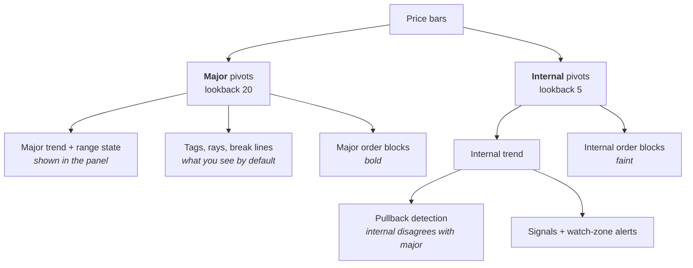
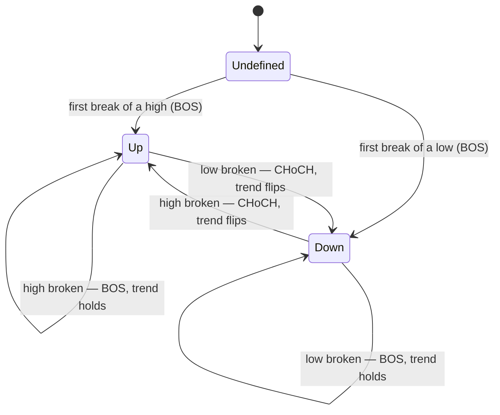
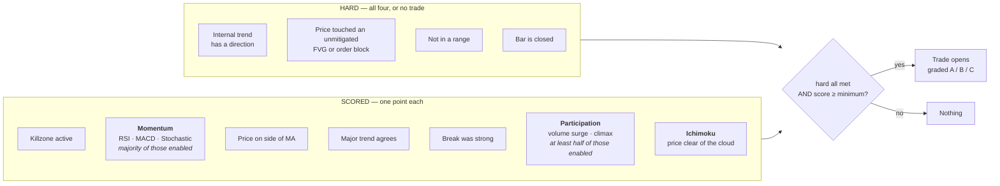

# TradingView Indicators

Two Pine Script v6 indicators for TradingView, written to be read as much as used. Both are single
self-contained files — no libraries, no external data, nothing to install beyond pasting the script
into TradingView.

| Script | What it does | Pane |
|---|---|---|
| [`src/ict-rsi-ma-indicator.pine`](src/ict-rsi-ma-indicator.pine) | Market structure, order blocks, fair value gaps and session killzones, scored into graded trade setups with an entry zone, a stop, targets and a trailing stop | On the price chart |
| [`src/gann-angles.pine`](src/gann-angles.pine) | Gann price levels (three modes) projected from an automatic or manual anchor, plus Gann time cycles | On the price chart |

They are independent. Run either on its own, or both together.

---

## Installing

1. Open a chart on [tradingview.com](https://www.tradingview.com).
2. Open the **Pine Editor** (bottom panel).
3. Open the `.pine` file from this repo, copy all of it, and paste it into the editor, replacing
   whatever is there.
4. Click **Add to chart**.
5. To keep it: **Save**, give it a name, and it appears under *Indicators → My scripts*.

Settings are reached with the gear icon next to the indicator's name on the chart.

---

# ICT + RSI/MA Confluence

## The idea

Price tends to reverse at levels it left in a hurry, and those reversals are worth taking **only when
several independent things agree at once**. This indicator finds those levels, tracks which direction
the market is structurally moving, and marks the bars where everything lines up.

It never tells you to buy. It marks a bar where several independent conditions happened to agree,
grades how many, and leaves the decision to you.

## Reading the chart


### The vocabulary

Most of this comes from "Smart Money Concepts" trading. The terms sound like jargon but each one
names something simple:

| Term | What it actually means |
|---|---|
| **Swing high / low** | A bar that is higher (or lower) than a set number of bars on both sides of it |
| **HH / HL / LH / LL** | Higher High, Higher Low, Lower High, Lower Low — how one swing compares to the previous one on the same side |
| **EQH / EQL** | Equal High / Equal Low. Two swings at nearly the same price. Stop-loss orders pile up just past them, so price is often drawn there |
| **BOS** | Break of Structure. Price closed past a swing **in the direction the trend was already going** — continuation |
| **CHoCH** | Change of Character. Price closed past a swing **against** the trend — this is what flips the trend |
| **Order block** | The last opposite-coloured candle before a structural break. Often revisited before price continues |
| **FVG** | Fair Value Gap: a three-bar pattern where the middle bar moved so fast it left a price gap. Price frequently returns to fill it |
| **Killzone** | A time window when a major session is active (London, New York). Volume concentrates here |

## How the structure engine works

Swings are detected at **two sizes at once**, because one setting cannot do both jobs. A small
lookback finds every wiggle — useful for timing an entry, useless for reading a trend. A large one
reads the trend cleanly but hides every level you'd actually trade off.



Both tiers run the same pipeline independently. The panel shows the major tier; the signal engine
currently reads the internal tier.

### BOS vs CHoCH — the trend state machine

The trend only ever changes on a **CHoCH**. A BOS confirms the trend you already had.



A break is only recorded when a **closed** bar closes past the level. A wick through it is not a
break, so nothing appears and then disappears on you.

Every break also records how hard it broke — the breaking candle's body divided by ATR — so a
convincing break and a barely-there one are distinguishable rather than one being silently discarded.

### The range state

Trend is not the whole story: a market can be technically "up" while going nowhere, and that is where
trend-following signals do the most damage. So a separate **Range** flag is raised when the last two
major highs and last two major lows all fit inside a narrow band (default 2.5 × ATR) **and** those
four swings are recent (default within 100 bars).

The second condition matters — without it, four swings scattered across hundreds of bars could
coincidentally sit in a narrow band and read as consolidation when nothing of the sort happened.

> **Range is a hard veto.** No trade opens while it reads `YES`, however good the setup looks — that is
> the point of tracking it. It is also shown in the panel so you can apply your own judgement to
> everything else on the chart.

### The structure panel

| Row | Meaning |
|---|---|
| **Major trend** | `UP`, `DOWN`, or `—` before the first break |
| **Range** | `YES` when structure is compressing — treat trend signals with suspicion |
| **Last event** | The most recent break: type, which tier, and its strength in ATR (e.g. `BOS · MAJOR · 1.4x`) |
| **Internal** | `aligned` when both tiers agree; `pullback` when the small tier is moving against the big one — often the setup you want |

## The trade engine

A triangle no longer just means "conditions agreed" — it means **a trade opened**, with an entry
zone, a stop, three targets and a stop that trails. One trade runs at a time; while it is open,
further setups are ignored.


### How a setup qualifies

Two different kinds of condition, and the difference matters:



The hard four are absolute because without them there is nothing to compute — no direction means no
side, and no zone means no entry price and no stop.

**The score is out of however many points you switch on, not a fixed seven.** That is deliberate.
Killzones mean nothing on a single-session market like EGX, so if killzone were a mandatory veto the
indicator would go permanently silent there. Switch the killzone point off and the panel reads `5/6`
instead of `5/7` — the threshold adjusts rather than quietly loosening. The same happens
automatically for points that cannot apply: turn off both killzone sessions and the killzone point
removes itself, and on a symbol that reports no volume at all the participation point removes itself.

**Three of the five confirmations share votes, on purpose.** RSI, MACD and Stochastic all measure
momentum from the same price series — counted separately they would cast three of ten votes for
what is really one opinion, and a setup could clear the threshold on momentum agreeing with itself.
They share the Momentum point, earned when at least half the enabled ones agree. Volume and the
climax candle share Participation the same way.

**Grades are a fraction of the enabled points** — A at 90%, B at 75%, C below that. So a grade means
the same thing whether you run four points or seven.

Set `Minimum Score` equal to the number of enabled points to get the strictest possible behaviour.

> **Upgrading from an earlier version?** `Minimum Score` now defaults to 5, because 4 out of seven
> points is a *looser* gate than the 4 out of five it used to mean. TradingView keeps the value saved
> on your chart, so if yours still reads 4, raise it by hand.

### Entry, stop and targets

| | Where it comes from |
|---|---|
| **Entry zone** | The FVG or order block price just touched — the range in which the setup is valid |
| **Entry price** | The signal bar's close. Not the zone midpoint: the close is what a market order would actually have got |
| **Stop** | The zone's far edge, plus an ATR buffer so an ordinary wick doesn't clip it |
| **1R** | Entry minus stop. Every R figure on the chart uses the *initial* stop, never the trailed one |
| **Targets** | The three nearest unbroken structure levels ahead, plus any EQH/EQL liquidity pool, each at least 1R away. If structure can't supply three, the rest fill at 1R/2R/3R |

### How the stop moves

1. **TP1 hit** → stop moves to entry. The trade can no longer lose.
2. **After that** → it follows each newly confirmed swing low (for a long), from whichever tier you
   pick in `Trailing Tier`. Internal trails tightly; Major gives the trade room.
3. **It never moves backwards.**

A trade closes when the stop is hit, when TP3 is reached, or when a **CHoCH** prints against it — you
can be wrong structurally without price having to travel all the way to your stop.

Two details that stop the results flattering themselves: if a bar's range spans both your stop and a
target, the trade is recorded as **stopped** (a bar-by-bar script cannot know which came first, so it
assumes the unfavourable one); and if a bar *gaps* through the stop, the exit is recorded at the open,
not at the stop price.

### Reading the trade panel

The panel carries a `Confirm` row showing the three confirmation points for the current bar —
`Mom ✓ · Part — · Ichi ✓`. A dash means the point is switched off or cannot apply; a cross means it
applies and is not met. `5/7` tells you a setup was adequate, but the row tells you *which* points
carried it, which is the part you can act on.

The structure panel grows extra rows while a trade is live: the setup and its grade with the score
fraction, entry, the current stop with its R distance, all three targets with R multiples and tick
marks as they are reached, and the trade's open R.

When a trade closes it leaves a single label at the exit bar — `+2.5R · Target`, `−1.0R · Stopped`.
Scroll back and those labels are your track record.

> **On cash-equity markets where you can't short**, set `Long Trades Only`. Bearish setups still mark
> and still alert, so you keep the information — they just don't open a trade.

## Alerts

Set these up with the alarm-clock icon → *Condition: ICT + RSI/MA Confluence*.

| Alert | Fires when |
|---|---|
| Bullish / Bearish Trade Entry | A trade opened — or, for the bearish one, a short setup qualified but was suppressed by `Long Trades Only` |
| Trade Opened | Any trade opened; check the panel for side, grade, stop and targets |
| Target Hit | A take-profit level was reached |
| Trade Closed | The trade ended — the result label on the chart carries the R and the reason |
| Bullish / Bearish Watch-Zone | Price is approaching an unmitigated zone during a killzone — a heads-up, not a signal |
| Major CHoCH | The major trend reversed |
| Major BOS | The major trend continued |

TradingView alert messages can't carry script values, so they point you at the chart rather than
claiming to quote a price or an R figure.

## Settings

**Market Structure** — the engine.

| Setting | Default | What it does |
|---|---|---|
| Major Swing Lookback | 20 | Bars either side a bar must dominate to count as a major swing. Bigger = fewer, more meaningful swings |
| Internal Swing Lookback | 5 | The fine tier. Also what signals read |
| Max Swings Kept | 10 | Per side, per tier. Broken swings are kept (not deleted) until this cap pushes them out |
| Structure ATR Length | 14 | Scales the three settings below |
| Equal-Level Tolerance (× ATR) | 0.15 | How close two swings must be to count as EQH/EQL |
| Range Band (× ATR) | 2.5 | How tight the four swings must be to call it a range. Lower = stricter |
| Range Lookback (bars) | 100 | How recent those swings must be |

**Trade Engine** — the gate and the trade.

| Setting | Default | What it does |
|---|---|---|
| Minimum Score | 5 | Points needed, out of however many are enabled below |
| Score: Killzone | on | **Turn off on single-session markets like EGX** |
| Score: Moving Average | on | Whether price is on the trade's side of the MA |
| Score: Major Trend Agreement | on | Whether the major tier agrees with the internal one |
| Score: Break Strength | on | Whether the break that set up the trade was a big candle |
| Strong Break (× ATR) | 1.0 | How big that candle's body must be to earn the point |
| Stop Buffer (× ATR) | 0.25 | How far beyond the zone edge the stop sits |
| Minimum Target Distance (R) | 1.0 | Structural levels closer than this are skipped |
| Trailing Tier | Internal | Which tier's swings the stop trails behind |
| Long Trades Only | off | For markets where you can't short |

**Confirmations** — three more scored points, five indicators.

| Setting | Default | What it does |
|---|---|---|
| Score: Momentum | on | One point for RSI, MACD and Stochastic together — earned when at least half the enabled ones agree (2 of 3, 1 of 2) |
| Momentum: RSI / MACD / Stochastic | on | Which indicators are members of that vote. Turn all three off and the point leaves the denominator |
| MACD Fast / Slow / Signal | 12 / 26 / 9 | Standard settings |
| Stochastic %K / Smoothing / %D | 14 / 3 / 3 | Read as a %K/%D cross, not an overbought level — in a trend the oscillator pins to its extreme and a level test would veto every continuation |
| Score: Participation | on | One point for evidence someone is actually trading here |
| Participation: Volume Surge | on | Volume on the bar that touched the zone, against its own average |
| Participation: Climax Candle | on | An exhaustion bar **against** the trade — for a long, a heavy down bar closing on its low into support. That is the pullback spending itself |
| Volume Average Length | 20 | Bars in the volume average that surge and climax both measure against |
| Volume Surge (× average) | 1.5 | How far above average counts as a surge |
| Climax Range (× ATR) / Volume (× average) / Lookback | 2.0 / 2.0 / 3 | How big an exhaustion bar has to be, and how recently it can have printed |
| Score: Ichimoku | on | One point when price is clear of the cloud on the trade's side. Inside the cloud earns nothing |
| Tenkan / Kijun / Senkou B / Displacement | 9 / 26 / 52 / 26 | Standard settings |
| Show Kumo Cloud | **off** | The only thing this section draws |
| Show Confirmation Panel Row | on | Adds `Mom ✓ · Part — · Ichi ✓` to the panel, so you can see which points carried a setup |

Chikou is deliberately absent: it is the close displaced 26 bars *backwards*, so scoring on it would
report confirmation that was not available at the time. MACD and Stochastic are never plotted —
this script draws on the price chart, and an oscillator has no pane to live in here.

**Structure Display** — what gets drawn. Internal rays and internal break lines are **off** by
default; on a fast timeframe they are near-continuous. Leave internal break lines off if you want a
long trade history to survive — their labels share the chart's 500-label budget with your result
labels.

**Fair Value Gaps / Order Blocks** — `Max Tracked` caps how many are kept per side (order blocks: per
side *and* per tier). `Include Internal-Tier Order Blocks` is on by default; turning it off leaves
only order blocks born from major structural breaks — far fewer, each more significant.

**Killzones** — session windows and their timezone. **RSI / Moving Average** — the periods behind the
RSI readout and the MA plot; RSI is also a member of the Momentum vote in **Confirmations**, above.
**Alerts / Display** — signal markers, the RSI readout, and how close price must get to a zone to
count as a watch-zone.

---

# Gann Angles

## The idea

W.D. Gann's methods project support and resistance from a single significant turning point, in
**price** and in **time**. This script picks that turning point for you (or takes one you type in),
draws the levels, and tells you which have already been reached.

## Reading the chart


## Three modes

| Mode | What it draws | Anchors needed |
|---|---|---|
| **Square of 9** *(default)* | Levels at 22.5° increments around Gann's spiral, in rings of 16 | One per direction |
| **Gann Fan** | Nine angled rays (1×8 through 8×1) read at a chosen bar distance, drawn as horizontal levels | One per direction |
| **Gann Square** | A box between a bullish and a bearish anchor, divided into a grid | **Both**, with the bearish price above the bullish one |

## Anchors

By default each side anchors to the **most recent confirmed swing** — a low for the bullish side, a
high for the bearish. "Confirmed" means the script waits `Swing Pivot Lookback` bars to be certain,
so a fresh anchor always appears that many bars after the actual turn.

To pin an anchor yourself, type a price into `Bullish Price` or `Bearish Price` (leave `0` for
automatic) and set the matching start date.

## Time cycles

Independently of the price levels, vertical lines mark 30, 45, 60, 90, 120, 144, 180, 270 and 360
bars forward from each anchor — dates Gann considered likely for a turn. The time table lists each
with its projected calendar date and whether it has been reached.

A `~` before a date means it was extrapolated from average bar spacing rather than read from a real
bar — which is what happens for cycles that lie in the future.

## The levels table

Each row is one level: its label, its price, and whether price has already **Touched** it or is still
**Pending**.

On a long chart nearly everything reads *Touched*, which buries the levels that still matter. So
`Max Touched Levels` (default 5) keeps only the touched levels **nearest current price** and hides the
rest — per direction, and applied to the lines and labels as well as the table, so you never see a
line with no row explaining it. Set it to `0` to hide touched levels entirely, or `100` to show
everything.

## Settings worth knowing

| Setting | Default | What it does |
|---|---|---|
| Mode | Square of 9 | Which geometry to draw |
| Swing Pivot Lookback | 50 | How major a turn must be to anchor to. Higher = fewer, bigger anchors, confirmed later |
| Rings *(Square of 9)* | 2 | Each ring is 16 levels. Max 3 |
| Scale Factor *(Square of 9)* | 1.0 | Raise this on high-priced instruments where all the levels bunch into a narrow band |
| ATR Length | 14 | Sets the price-per-bar unit for Fan slopes and Square width. Sampled once at the anchor and held, so the geometry does not drift |
| Max Touched Levels | 5 | Per direction. See above |

The two tables must sit in **different screen corners** — TradingView draws only one table per
position, so if `Table Position` and `Time Table Position` match, one hides the other.

---

## Things worth knowing before you trade either of these

**Nothing repaints, but confirmation is late by design.** A swing is only recognised `lookback` bars
after it forms, and breaks are only recorded on closed bars. Nothing that appears will later vanish —
the trade-off is that everything arrives a little after the fact. That is the honest cost of not
repainting.

**Signals form on the closing bar.** A signal that appears mid-bar can still disappear if the bar
closes differently. Wait for the close.

**Tune the lookbacks to your timeframe.** The defaults suit intraday charts. On a daily or weekly
chart a major lookback of 20 finds very few swings; on a 1-minute chart it finds too many. If the
chart looks wrong, this is almost always why.

**Drawings only reach so far back.** Pine anchors a drawing by counting bars back from the current
one, and that count is capped by the script's declared history buffer — 5000 bars for the confluence
indicator, 500 for Gann Angles. Beyond that limit the confluence indicator drops a swing tag rather
than move it to a bar that never made the high, and starts a ray, break line or trade box at the edge
of the buffer instead of at its true origin. The price levels themselves are unaffected. You will
only meet this on a very long intraday chart.

**These are decision-support tools, not a strategy.** Neither script backtests, sizes a position, or
places an order. The trade engine computes levels and records what would have happened; it does not
size a position and it has no idea what your account can absorb. No indicator knows the future, and
confluence between several lagging measurements is still lagging. Nothing here is financial advice.

---

## Repository layout

```
src/                    the two Pine scripts
docs/img/               diagrams used by this README
docs/superpowers/
  specs/                design documents — what each feature does and why
  plans/                implementation plans
```

The `specs/` folder is the interesting one if you want to understand *why* something works the way it
does. Each feature has a design document recording the decisions and the alternatives that were
rejected.
